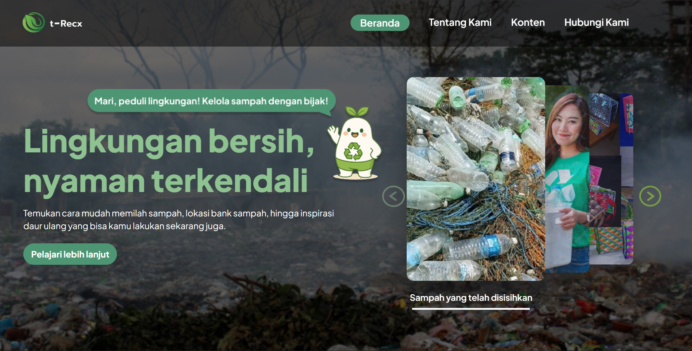

# t-Recx



t-Recx adalah sebuah website yang dikembangkan oleh tim kreatif muda yang peduli terhadap isu lingkungan, khususnya masalah sampah rumah tangga di Indonesia. Platform ini dirancang untuk memberikan edukasi, meningkatkan kesadaran, serta mengajak masyarakat berpartisipasi dalam aksi nyata menjaga lingkungan.

---

## **Deskripsi Website**

Website t-Recx menghadirkan pengalaman interaktif dengan tampilan modern, ringan, dan responsif. Dibangun menggunakan ReactJS, project ini mengusung struktur komponen yang mudah dipahami dan dikembangkan.

**Fitur utama:**
- Navigasi responsif termasuk mobile burger menu  
- Halaman edukasi jenis-jenis sampah  
- UI modern dan clean  
- Komponen modular  
- Mudah dikembangkan untuk kebutuhan lanjutan  

---

## **Petunjuk Instalasi**

### **1. Clone repository**
```bash
git clone https://github.com/username/t-recx.git
```

### **2. Masuk ke direktori project**
```bash
cd t-recx
```

### **3. Install dependencies**
Menggunakan npm:
```bash
npm install
```
Atau yarn:
```bash
yarn
```

---

## **Cara Menjalankan Project**

### **Development mode**
Menjalankan server lokal:
```bash
npm run dev
```
Atau:
```bash
yarn dev
```

Akses melalui:
```
http://localhost:5173/
```

---

### **Build untuk Production**
```bash
npm run build
```
Atau:
```bash
yarn build
```

---

### **Preview hasil build**
```bash
npm run preview
```

---

